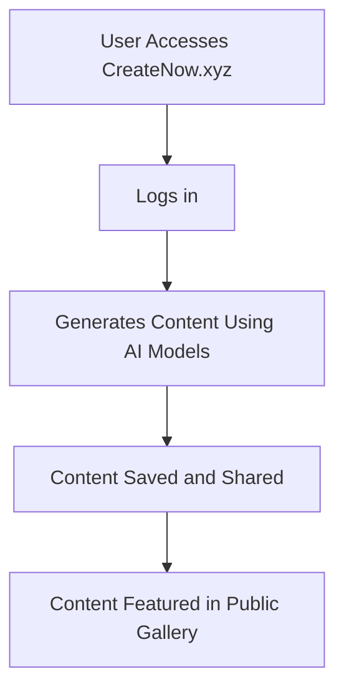
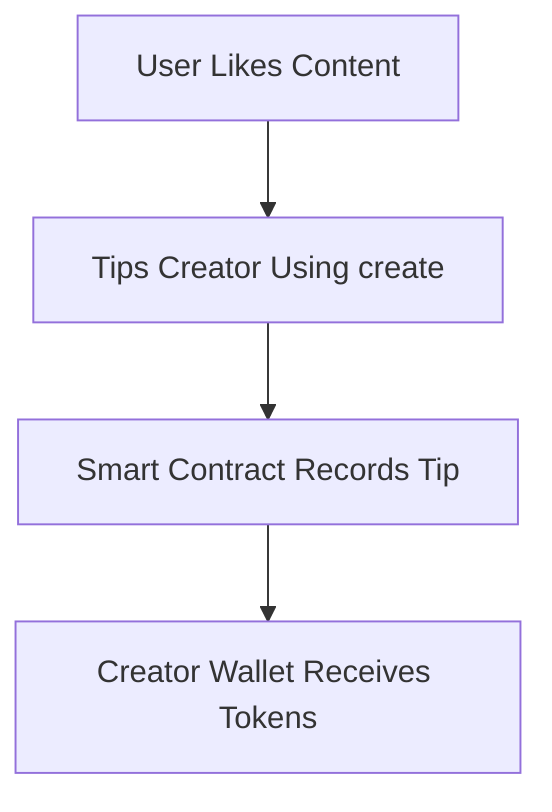
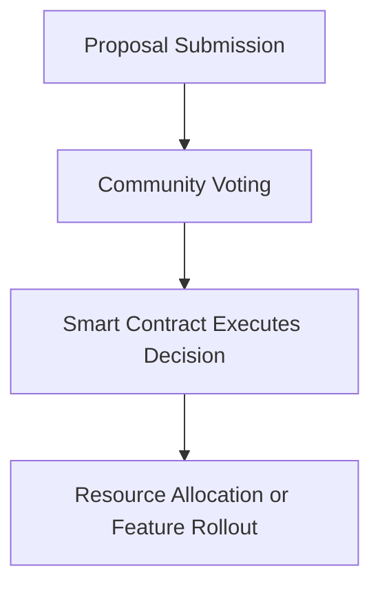
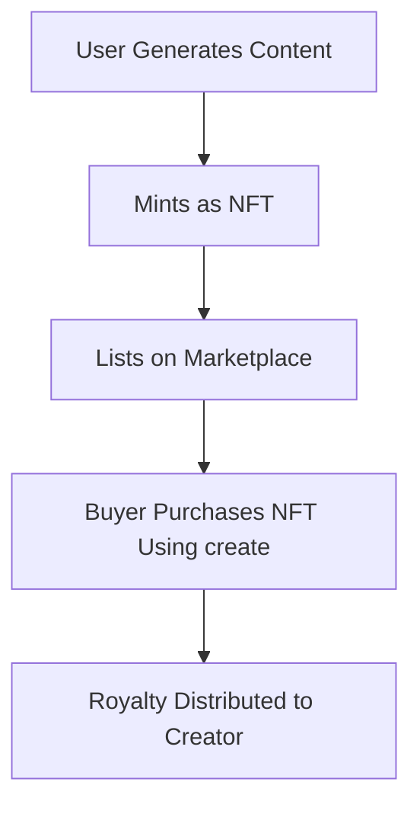
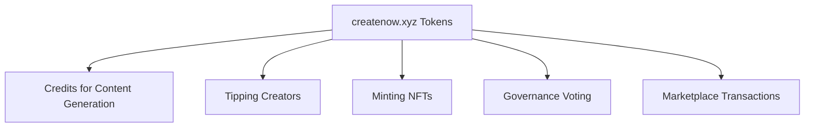
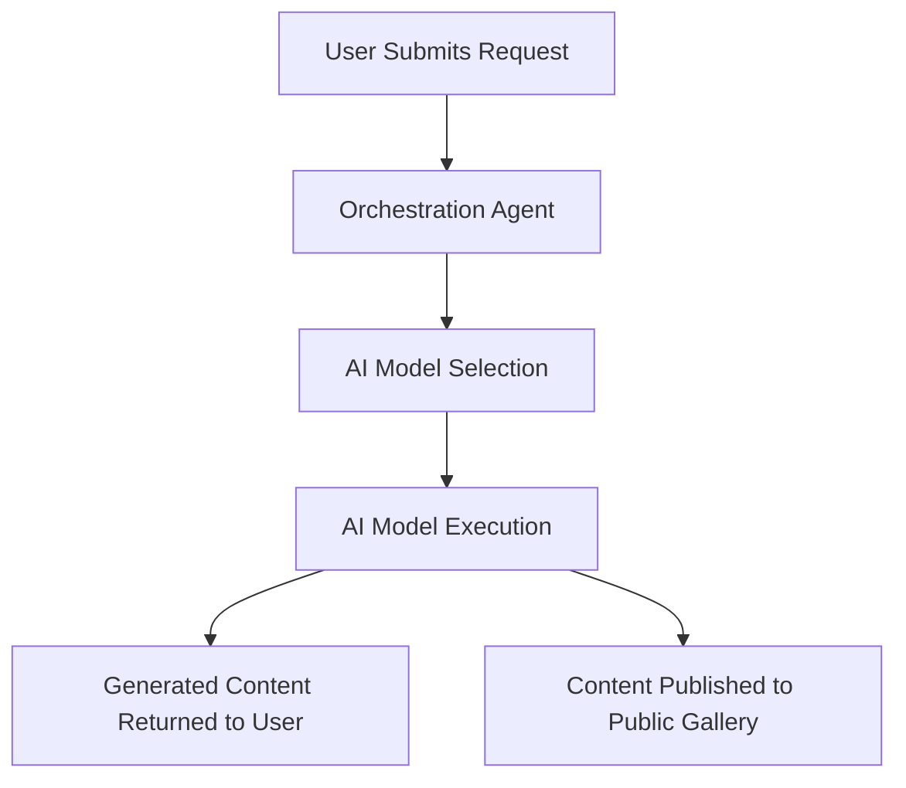

# CreateNow White Paper: A Decentralized Ecosystem for AI-Powered Content Creation

**Version 1.0 | January 2025**

## Abstract

CreateNow is a decentralized platform designed to revolutionize content creation through AI-powered tools. Anchored by the createnow.xyz Token (create), the platform enables users to generate, share, and monetize content in a decentralized manner. Leveraging Swarms Cloud infrastructure, blockchain technology, and fostering an active community of creators and users, CreateNow aims to become the global hub for AI-generated content. Early features include image and music generation, with a roadmap to incorporate state-of-the-art AI models and open-source datasets, empowering a new era of innovation and collaboration in content creation.

By decentralizing content creation, CreateNow removes barriers to entry, ensures fair compensation for creators, and fosters innovation by enabling the open exchange of ideas and resources. The platform's tokenomics, governance model, and focus on inclusivity make it a pioneering effort to redefine how content is created and consumed in the Web3 era.

## 1. Introduction

### 1.1 Background

The rapid growth of AI-generated content has unlocked unprecedented opportunities for creators and consumers alike. From generating visually stunning images to composing music, AI is reshaping how content is created and consumed. However, the centralization of AI services has created significant barriers:

Access Limitations: Many advanced tools are locked behind paywalls or restricted to specific geographies.

Bias and Censorship: Centralized models often reflect the biases of their creators, limiting diversity and representation.

Innovation Bottlenecks: Proprietary ecosystems stifle collaboration and innovation.

CreateNow addresses these challenges by introducing a decentralized platform that democratizes access to AI tools and fosters open collaboration. By blending blockchain technology and state-of-the-art AI infrastructure, CreateNow empowers creators to own their content and rewards them for their contributions.

The platform's decentralized approach ensures that creators retain full control over their work, while fostering a collaborative environment that encourages experimentation and innovation. By leveraging the power of blockchain and AI, CreateNow bridges the gap between technology and creativity, empowering users to explore new horizons in content generation.

### 1.2 Vision

The vision of CreateNow is to:

- Provide a Home for Content Creation: Build an inclusive, collaborative platform where creators can share and monetize their work.
- Enable Open-Source Innovation: Train and publish open-source datasets and models to advance the state-of-the-art in AI-generated content.
- Incentivize Participation: Implement a robust reward system with tipping, incentives, and tokenized payments.
- Empower Governance: Transition to a Decentralized Autonomous Organization (DAO), enabling the community to shape the platform's future.
- Democratize Access: Ensure that cutting-edge AI tools are available to users regardless of their geographical or economic status.

## 2. Initial Features

### 2.1 Platform Launch

The initial launch of https://createnow.xyz introduces the foundational features of the platform:

- Integration with Swarms Cloud: Leveraging scalable AI compute for efficient content generation.
- Core Features: Image and music generation using cutting-edge AI models.
- User-Friendly Interface: A simple and intuitive interface for content creation and sharing.
- Content Sharing: Users can upload and share their generated content directly on the platform's gallery, fostering a community of inspiration and collaboration.

### 2.2 Coin Launch

The createnow.xyz Token (create) serves as the backbone of the platform's economy, enabling:

- Payments: Users can purchase content generation credits.
- NFT Minting: Mint and trade AI-generated NFTs.
- Tipping: Reward creators directly.
- Governance: Participate in DAO decision-making.
- Marketplace Transactions: Facilitate the buying and selling of content and services within the CreateNow ecosystem.

### 2.3 Early Partnerships and Feedback

CreateNow aims to foster collaboration with:

- Creators and Developers: Building tools and features aligned with user needs.
- Industry Stakeholders: Establishing partnerships to expand the platform's reach.
- Community Engagement: Gathering feedback to guide enhancements and prioritize feature development.
- Academic Institutions: Partnering with research organizations to explore the ethical implications of AI-generated content.

## 3. Detailed Roadmap

### Phase 1: Launch (Q1 2025)

Objective: Establish foundational features and build community momentum.

Platform Launch:

Launch of https://createnow.xyz with initial features such as image and music generation.

Basic user interface for content creation and sharing.

Integration of a public content gallery to showcase user-generated content.

Coin Launch:

Deploy the createnow.xyz Token (create) on the Solana blockchain.

Token distribution: 60% for public sale, 10% locked for the team (vesting), 10% allocated to the treasury, and 20% reserved for strategic use.

Feedback Collection:

Onboard early adopters and refine features based on user insights.

Host community events and hackathons to encourage user engagement and collect actionable feedback.

Technical Diagram: Platform Launch Workflow

### Phase 2: Ecosystem Expansion (Q2–Q4 2025)

Objective: Enhance capabilities, integrate new features, and scale the ecosystem.

New Features:

Expand AI modalities to include text-to-speech (TTS) and video generation.

Integrate decentralized storage solutions such as IPFS or Filecoin.

Enable collaborative content generation tools, allowing multiple users to co-create content in real time.

Open-Source Initiatives:

Publish datasets of AI-generated content.

Release state-of-the-art AI models as open-source projects.

Host workshops and webinars to educate users on leveraging open-source tools for content creation.

Tipping System:

Enable users to tip creators using create tokens.

Integrate tipping with social media platforms to extend the reach and utility of the CreateNow ecosystem.

Technical Diagram: Tipping System Workflow

### Phase 3: Decentralized Content Economy (2026)

Objective: Foster a thriving content creation and sharing economy.

Content Marketplace:

Launch a decentralized marketplace for trading and licensing AI-generated NFTs.

Implement royalty mechanisms for creators.

Enable dynamic pricing models based on content quality and demand.

Creator Rewards:

Establish a reward pool for active creators and contributors.

Introduce gamification elements to encourage consistent participation and innovation.

Governance Rollout:

Transition to a DAO model, empowering token holders to vote on platform improvements and policies.

Enable proposal submissions for new features and community initiatives.

Technical Diagram: DAO Governance Cycle

### Phase 4: Global Adoption and Innovation (2027+)

Objective: Achieve mainstream adoption and drive innovation in content generation.

Global Partnerships:

Collaborate with media companies, brands, and educational institutions.

Partner with NGOs and international organizations to promote ethical AI use.

Scalability Enhancements:

Optimize Swarms Cloud integration for global scalability.

Enable cross-chain interoperability for create tokens and NFTs.

Cutting-Edge AI Research:

Invest in multi-modal content generation research.

Continuously improve AI models based on user feedback and published datasets.

Establish a research fund to support AI ethics and transparency initiatives.

Technical Diagram: Content Economy Workflow

## 4. Tokenomics

### 4.1 createnow.xyz Token (create)

Purpose: Governance, payments, and rewards.

Utility:

Pay for content generation.

Mint AI-generated NFTs.

Tip and reward creators.

Vote in DAO governance.

Participate in community-led initiatives and events.

### 4.2 Distribution

Team and Development: 10% (vesting over time).

Treasury: 10%

Public Sale: 60%

Strategic Reserves: 20%

Technical Diagram: Token Utility Overview

## 5. Architecture

Overview: The CreateNow architecture orchestrates user interactions, AI model execution, and decentralized data storage while maintaining a seamless user experience.

Workflow:

User Interaction: A user submits a content generation request through the platform.

Orchestration Layer: The orchestration agent determines the optimal AI model for the request.

AI Model Execution: The selected model generates the content.

Content Delivery: The generated content is returned to the user and optionally published to the gallery for public use.

Technical Diagram: Platform Architecture

## 6. Conclusion

CreateNow pioneers a new era of decentralized content creation by combining state-of-the-art AI models with blockchain technology. By empowering creators and users with innovative tools, tokenized rewards, and community-driven governance, the platform ensures sustainable growth and innovation. With a clear roadmap, robust technical foundation, and a commitment to inclusivity and transparency, CreateNow is poised to redefine content creation and sharing for the decentralized web.

By joining CreateNow, users become part of a dynamic ecosystem that values creativity, transparency, and community engagement. Together, we can shape the future of content creation and establish a new standard for decentralized innovation.

Join us at https://createnow.xyz to shape the future of decentralized content!
